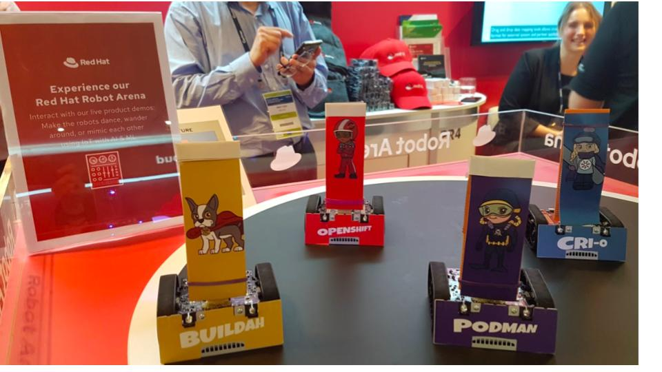

# Play back movements recorded on a robot

## This is one of the components in the Robot Demo involving MQTT, Fuse Online, AMQ Streams (Kafka) and physical robots.

Here isa high-level view of all the components involved:

And here are the robots:

## This is meant to be deployed onto Openshift

### Prerequisites

* deployed a MySQL database in your Fuse Online Project
* Initialised the MySQL database with the src/main/resources/mysql.sql script

### Deploy playback
Follow the following steps (assuming you've already created a project named playback on Openshit and updated the src/main/resources/application.properties file to reflect the mysql-specific parameter values):

* oc policy add-role-to-user view -n playback -z default
* oc create configmap playback --from-file=src/main/resources/application.properties -n playback
* oc get configmap playback -o yaml -n playback
* mvn clean fabric8:deploy -Dmaven.test.skip=true -Popenshift -Dfabric8.namespace=playback
* create a route for playback if required
* access the route and you will see a web interface as show below

playback web interface:

